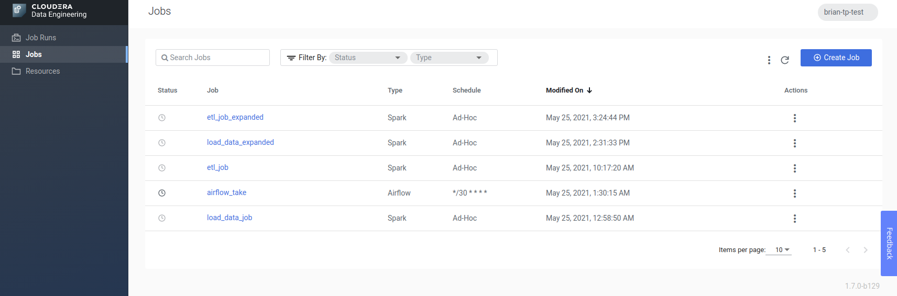

# CDE Example Data Ingestion


This is an example of how to build out a Cloudera Data Engineering Workflow,

## Structure

PySpark and Airflow code is under: `src/main/python`

This consists of two PySpark jobs:
- `load_data.py` - reads data from aws open data
    - See: https://community.cloudera.com/t5/Community-Articles/External-AWS-Bucket-Access-in-CDP-Public-Cloud/ta-p/302074 for accessing outside buckets in CDP

- `etl_job.py` - transforms data into an final reporting table

- `airflow_job.py` - Airflow DAG for schduling the sequence of tasks

## Writing Jobs for CDE

With CDE, the executor settings and additional spark configuration flags are set via the CDE UI and CLI and do not need to be set in spark session as per normal.

with the load_data script we used the following settings:


Note in particular the bucket settings, this is because we need for spark to be able to access botht the open data `s3a://nyc-tlc` bucket and our configured cdp datalake bucket in this case `s3a://blaw-sandbox-2-cdp-bucket` 

## Setting up CDE and Airflow

Setup `load_data.py` and `etl_job.py` as individual jobs in CDE.
 including setting up the executor settings and `hadoopFileSystems`.

note down the names of the jobs as you have entered them.

In the `airflow_job.py` the job_names need to be entered as per what was entered into the cli ie

```{python}

# job_name needs to match what is in the CDE UI
load_data_job = CDEJobRunOperator(
    task_id='loader',
    dag=cde_process_dag,
    job_name='load_data_job'
)

```
## Airflow Notes

Airflow jobs has to consist of a single DAG

CDE Jobs are defined with `CDEJobRunOperator` the execution order of the jobs can then be set with

```python

start >> load_data_job >> etl_job >> end

```

Note that branching is supported as well so we could do something like this in a more advanced `DAG`

```python

start >> load_data_job
load_data_job >> etl_job_1
load_data_job >> etl_job_2

```

Both fanning out from `load_data_job` to multiple `etl_job` and fanning back in from `etl_job` to some sort of summary job is supported.

## Further Reading

Walmart Global Tech - Airflow Beginners Guide: https://medium.com/walmartglobaltech/airflow-the-beginners-guide-684fda8c87f8

Understanding Cron timers: https://crontab.guru/#*/30_*_*_*_*

Understanding Airflow DAGs: https://towardsdatascience.com/airflow-how-and-when-to-use-it-2e07108ac9f5