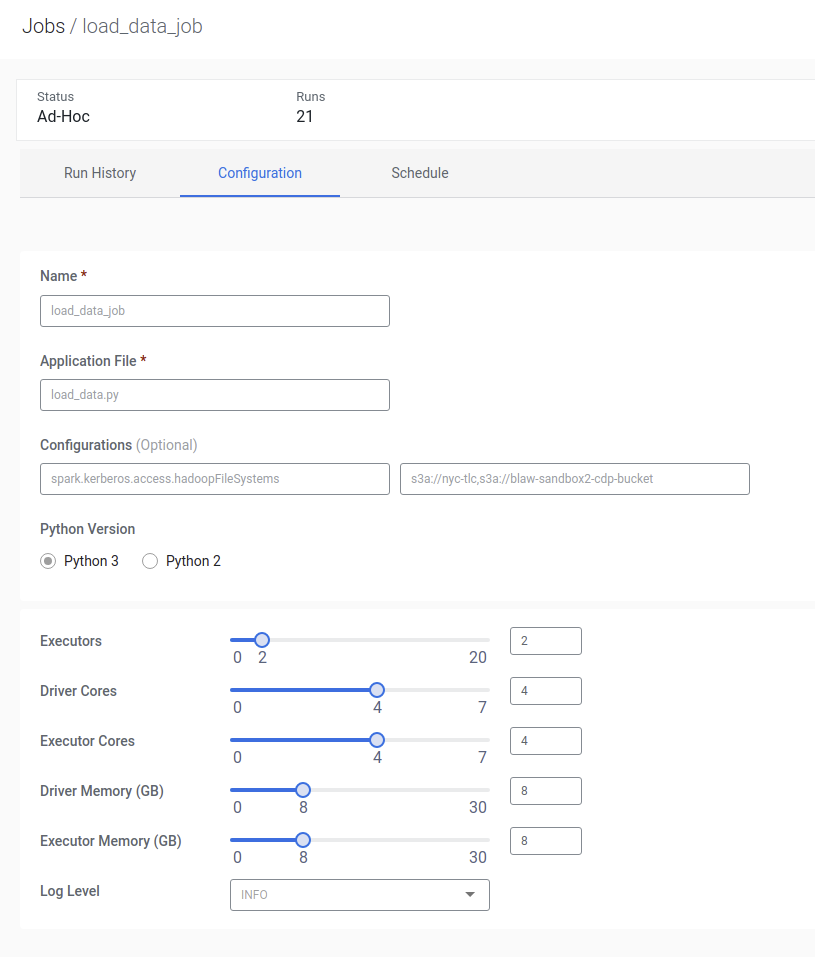

# CDE Example Data Ingestion


This is an example of how to build out a Cloudera Data Engineering Job,

## Structure

PySpark and Airflow code is under: `src/main/python`

This consists of two PySpark jobs:
- `load_data.py` - reads data from aws open data
    - See: https://community.cloudera.com/t5/Community-Articles/External-AWS-Bucket-Access-in-CDP-Public-Cloud/ta-p/302074 for accessing outside buckets in CDP

- `etl_job.py` - transforms data into an final reporting table

- `airflow_job.py` - Airflow DAG for schduling the sequence of tasks

## Writing Jobs for CDE

With CDE, the executor settings and additional spark configuration flags are set via the CDE UI and CLI and do not need to be set in spark session as per normal.

with the load_data script we used the following settings:


Note in particular the bucket settings, this is because we need for spark to be able to access botht the open data `s3a://nyc-tlc` bucket and our configured cdp datalake bucket in this case `s3a://blaw-sandbox-2-cdp-bucket` 
## Airflow Notes

Airflow jobs has to consist of a single DAG

CDE Jobs are defined with `CDEJobRunOperator` the execution order of the jobs can then be set with

```python

start >> load_data_job >> etl_job >> end

```

Note that branching is supported as well ie

```python

start >> job1

```

## Further Reading

Walmart Global Tech - Airflow Beginners Guide: https://medium.com/walmartglobaltech/airflow-the-beginners-guide-684fda8c87f8

Understanding Cron timers: https://crontab.guru/#*/30_*_*_*_*

Understanding Airflow DAGs: https://towardsdatascience.com/airflow-how-and-when-to-use-it-2e07108ac9f5