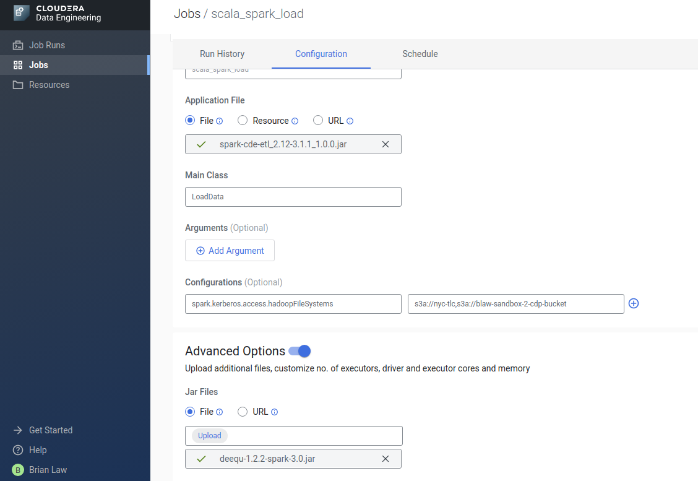
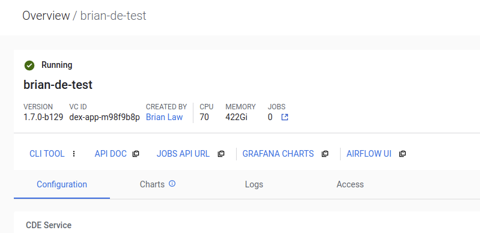

# Working with Cloudera Data Engineering From 0 to Productivity!

Cloudera Data Engineering (CDE) is Cloudera's new Spark as a Service offering on Public Cloud. It features kubernetes auto-scaling of spark workers for efficient cost optimisation, a simple UI interface for job management and an integrated Airflow Scheduler for managing your production grade workflows.

In this article we will not focus on service deployment. For that see: https://docs.cloudera.com/data-engineering/cloud/enable-data-engineering/topics/cde-enable-data-engineering.html
What we will cover is how to adjust your applications to fit CDE's paradigm, deploy them and schedule them by working through some example applications in python and scala.

## Developing Apps for Cloudera Data Engineering

In CDE, an application is called a job. This takes the form of a main jar file or python script with attached resources <to flesh out>

Depending on which language you wish to use, the development setup will be slightly different. We will go through those at a high level later. 

For creating and managing jobs, you can interact with CDE via the UI or the CLI. We will mainly use the UI here. For instructions on setting up the CLI see: https://docs.cloudera.com/data-engineering/cloud/cli-access/topics/cde-cli.html

The CLI will be needed for CI/CD integration and also access to some of the deeper functionality within CDE but is not needed for most day to day tasks. It can also be used by external applications to monitor the status of CDE jobs.
## Structure of this repo

To support this article, we have developed some example applications. The application code sits under `src/main/python` and `src/main/scala` respectively. Code for the airflow example DAG sits under `src/main/airflow`.

<restructure and move>

- `airflow_job.py` - Airflow DAG for schduling the sequence of tasks

Scala Code is available under: `src/main/scala`

This consists of two Scala jobs:
- `LoadData.scala`
- `ETLJob.scala`
<restructure and move>

### Writing Apps for CDE - Common Concepts

With CDE, the `SparkSession` setting for `executor` and `driver` should be set through CDE options in UI or CLI rather than in the application itself. Including them in the code as well can result in abnormal behaviour.

```python

######## DON'T
### Standalone Spark / CDH Spark

spark = SparkSession \
    .builder \
    .appName("Load Data") \
    .config("spark.executor.cores", "6") \
    .config("spark.executor.memory", "10g") \
    .config("spark.num.executors", "2") \
    .enableHiveSupport() \
    .getOrCreate()

######## DO
### CDE Spark

spark = SparkSession \
    .builder \
    .appName("Load Data") \
    .enableHiveSupport() \
    .getOrCreate()

```

with the CDE CLI this comes as part of the `cde job create` command. 

```bash

# cde cli job for the above settings
cde job create --application-file <path-to-file> --name <job_name> --num-executors 2 --executor-cores 6 --executor-memory "10g" --type spark

## Note Jobname is a CDE property and doesn't correspond to appName

```

For configuration flags, they should be added under the Configurations section of the UI


or the `--conf` option in the `cde cli`

```bash

cde job create --application-file <path-to-file> --name <job)name> --conf spark.kerberos.access.hadoopFileSystems=s3a://nyc-tlc,s3a://blaw-sandbox2-cdp-bucket --type spark

```

## Example Jobs

In this example, we will read in some of the nyc taxi dataset. See: https://toddwschneider.com/posts/analyzing-1-1-billion-nyc-taxi-and-uber-trips-with-a-vengeance/ for a full write up on the NYC Taxi dataset and cool things that can be done with it.

For the purposes of this exercise, we will read in the pre_2015 NYC Taxi dataset and the first half of 2015 taxi dataset from the AWS open data registry: https://registry.opendata.aws/nyc-tlc-trip-records-pds/

For this particular exercise, we need to access the AWS open data `s3a://nyc-tlc` bucket. By default, CDP Seecurity settings only allow access to the CDP data bucket setup during the initialisation of the CDP Environment. See: https://community.cloudera.com/t5/Community-Articles/External-AWS-Bucket-Access-in-CDP-Public-Cloud/ta-p/302074 for a full write up on how to access external buckets for CDP Public Cloud.

For the purposes of this exercise, I added a policy to my `DataLake Admin Role` to access `nyc-tlc`. To ensure that the Spark Applications in CDE can take advantage of this, I added in the spark configuration `spark.kerberos.access.hadoopFileSystems` with the value set to `s3a://nyc-tlc,s3a://blaw-sandbox2-cdp-bucket`. In my case, my default CDP data bucket is `blaw-sandbox2-cdp-bucket` but yours will vary.
### Building Jobs for CDE - Python

For python developers, explore the folder: `src/main/python` in there are two jobs, `load_data.py` and `etl_job.py` Both are quite simple spark applications with no external dependencies. We will get to dependency management later.

Exploring `load_data.py`, you can see that the `SparkSession` segment is quite concise. Also of note is that the Cloudera SDX layer, sets the kerberos settings and makes sure that aws iam roles is handled automatically; there is no need to assign these in code via spark configuration. 

For deploying the `load_data` script, we can simply define it as a new job in the CDE UI.

For this particular example, we setup the load_data script used the following settings:


For the `etl_job` script, I set it up like below 


Once they are running we can see it appear under jobs runs
 


### Python Dependency Management

For many advanced jobs, pure PySpark may not suffice and it maybe necessary to import in Python packages.
For in-house libraries and extra scripts, the approach it straight forward. The CDE UI or the `--py-file`, `--jar` and `--file` flags in the CLI allow for attaching extra packages and files into the execution environment as per a standard `spark-submit`.

It is quite common to leverage external repositories like `PyPI`, however and these cannot simply be attached. Common solutions include using things like `conda-pack`, `venv` or `PEX` to package up python libraries into a bundle to be unzipped by the executors as part of running the job.

With CDE, we have built-in an option akin to the `venv` solution. Note at moment of writing, setting this up can only be done via the CLI. All we need for this is a standard `requirements.txt` file as is standard practice with Python projects and our CDE CLI all setup.

CDE has the concept of resources which is a collection of files, environments etc that can be mounted into the instances running a spark job. 

To create a new resource run:
```bash
cde resource create --name my_custom_env --type python-env

```

To upload a `requirements.txt` run
```bash
cde resource upload --name my_custom_env --local-path requirements.txt
```
In this case, `--local-path` refers to the local instance where you are running the CDE CLI.

There are currently limitations with this process. Many advanced Data Science and Analytics libraries are not pure python code and require extra OS level libraries or compiling C++ libraries to ensure good performance.

For these use-cases a fully customised image is required for CDE to start the drivers and executors with. Note that this is currently in Tech Preview and will require the assistance of your account team to activate. Building a full custom environment requires the use of Docker and proper Cloudera Paywall credentials to pull the base image from the Cloudera docker repo.

See `cde-docker-image` for an example image. Things to note are the base image:

```docker
FROM container.repository.cloudera.com/cloudera/dex/dex-spark-runtime-3.1.1:1.7.0-b129
```

Depending on what version of spark and what version of CDE is being run, a different base image will be required. The base image though it is an ubuntu image is setup to use `dnf` for package management not `apt` as per normal.  

Once you have your image built and uploaded to a docker repo that CDE can reach, it is possible to create a cde job that leverages this. Note customising the base image can also only be done in the CLI at this stage.

First create a resource as before

```bash

cde resource create --type="custom-runtime-image" --image-engine="<spark2 or 3>" --name="<runtime_name>" --image="<path_to_your_repo_and_image>"

```

Then create your job on top of this image

```bash

cde job create --type --name <your_job_name> --runtime-image-resource-name <runtime_name> --application-file <your_job_file>

```

For more information including using password protected docker repos see: https://blog.cloudera.com/managing-python-dependencies-for-spark-workloads-in-cloudera-data-engineering/


### Building Jobs for CDE - Scala

To work with Scala in CDE, you need to have an environment into order to build jar files. In this particular repo, we will leverage sbt, though maven is an option too. See: https://www.scala-sbt.org/1.x/docs/Setup.html  for more information on setting up a sbt environment for compiling jars. It maybe useful to set this up in a docker container for easy reproducability.

There are two key parts of a scala project. The `build.sbt` file which is in the root path where we will run `sbt`. This file includes information about the required libraries. Of note in the sample one is the `provided` flag which indicates to sbt that these are in the build environment already. The CDE base image already includes Spark / Hadoop and other base dependencies. Including them again could cause issues.

For novice scala developers, it is also important to note that Scala versions are not cross compatible. Spark 3.x only suppports scala 2.12.x for example. Once we have correctly setup our scala code under `src/main/scala` with an accompanying `build.sbt` in the base directory, we can run `sbt clean package`


For first time scala devs, it is worth noting that there are two main approaches to building jar files for Spark. Jars can be built with all external dependencies included. This can make life easier but it also makes jar files larger. 

They can also be built with no dependencies in case external dependencies, in our case, we included the `Deequ` library for data validation. So we need to attach the `Deequ` jar for scala 2.12 as one of the extra jars to our job. This can get pretty messy pretty fast though. As an example `geomesa-spark-jts` for example which adds GIS functionality to Spark also depends in turn on other external libraries. We would have identify these and also upload them.



Jars without dependencies are commonly called slim jars and those with dependencies are called fat jars.

To build jars with dependencies, add a `project` folder with a file `plugins.sbt` inside this file, add:
```sbt
addSbtPlugin("com.eed3si9n" % "sbt-assembly" % "0.14.9")
```
The build command then becomes `sbt clean assembly`. For more information on using sbt for Spark jobs see:  
https://mungingdata.com/apache-spark/introduction-to-sbt/ For extra details on the assembly plugin see: https://github.com/sbt/sbt-assembly

## Scheduling Jobs

By default, CDE support cron for scheduling jobs. Cron has a specific syntax like `0 12 * * ?`. To understand what these expressions mean and how to write one see: https://www.baeldung.com/cron-expressions
Alternatively, try this tool to easily test out cron expressions and what they mean: https://crontab.guru/#*/30_*_*_*_*

Whilst powerful, cron doesn't help with scheduling interdependencies between jobs. For this, we need to leverage the built in Airflow scheduler. Airflow is powerful scheduling tool originally developed by Airbnb that allows for coding up advanced interdependencies between jobs.

The core unit in airflow is a Directed Acyclical Graph (DAG) the DAG determines the executor order of task and sets the parameters for each task to be run. Tasks in Airflow are called `Operators` since each one "operates" to execute a different task. For executing CDE jobs, we have a `CDEJobRunOperator` which is defined like below:

```{python}

my_airflow_task = CDEJobRunOperator(
    task_id='loader', # a name to identify the task
    dag=cde_process_dag, # the DAG that this operator will be attached to
    job_name='load_data_job' # the job that we are running.
)

```

Note that the `job_name` must match how the job was setup in CDE. 


For example with the above setup, we could sequence the Spark jobs `etl_job_expanded`, `load_data_expanded`, `etl_job` and `load_data_job`. In Airflow individual DAGs and their associated operators are defined in Python files for example see, `src/main/airflow/airflow_job.py`. 

Note that there can only be one DAG per airflow job. For most workflows, this will suffice. Airflow offers support for branching and merging dependencies too. The only time when we might need to coordinate multiple DAGs is if we need `Operators` running at different time intervals that have interdependencies. That is a pretty advanced topic and we will not cover this here. 

With the individual Operators and the DAG defined, we can set the execution order of the jobs for example.

```python

start >> load_data_job >> etl_job >> end

```

This means that execution order of the operators is `start` then `load_data_job` then `etl_job` and finally `end` We can also define the dependencies across multiple lines. For example, to do branching we could define something like this.

```python

start >> load_data_job
load_data_job >> etl_job_1
load_data_job >> etl_job_2

```
## Troubleshooting and Debugging

So now, you can setup and schedule python and scala jobs in CDE. But what happens when things go wrong? First we need to have some understanding on how CDE fits together. In CDP-Public Cloud everything starts with the environment.

An environment consists of a CDP DataLake which also contains the core security services. Attached to this is a CDE Service. There can be multiple CDE Services per DataLake. The way that a CDE Service is started determines what compute instances jobs can run on and the maximum number of compute instances that can be active.

For each CDE Service we can have multiple Virtual Clusters. The Spark Version and max autoscale capacity of jobs is set on the Virtual Cluster level.

In short:

CDP Environment (DataLake)
- CDE Service 1 (node-level scaling set here)
    - Virtual Cluster 1 (job-level scaling set here)
        - Job 1
        - Job 2..x
    - Virtual Cluster 2...x
- CDE Service ... x

Depending on the type of issues that we are troubleshooting we will need to examine what is going on on different levels.

### Understanding capacity issues

A common issue is running out of capacity. Remember we set this on two levels. A hard cap on the number of nodes allowed at the Service level and also a hard cap on the resources for a specific virtual cluster too.


Above we can see the Menu screen for the CDE Service. Note that we can see that current 0/75 nodes are active with 0/1200 CPUs being used and 0/4800GB Memory being used. We can monitor the status of the cluster with the Grafana Charts and also the Resource Scheduler buttons. 

The Grafana Charts show the status of the cluster and general number of jobs running.


To understand a bit more about what our cluster is up to we need to check the Resource Scheduler as well. Clicking on that tab will take us to:


Under the Queue tab in the Yunikorn menu we can see the current status of the queues in the system. Now this is the first confusing bit. Why is the queue showing so little memory and why is cpu 51% utilised? This is because Yunikorn only knows about the nodes that are currently active and not how many we can potentially spin up. As jobs run and the cluster scales we will see this number increasing


On the Virtual Cluster Level, we have this cluster overview. Unfortunately, we cannot see who many of the 70 CPU and 422Gi of Memory is consumed.



But we can go into the grafana screen for the virtual cluster and see how many resources we are using and also potentially requesting.


Through the analysis of those screens, we can understand the state of resource consumption in the CDE Service. Issues with jobs starting will commonly be due to issues at this level. With either the YuniKorn scheduler being unable to schedule jobs or the cluster autoscaler not being able to add nodes. It is worth pointing out at this juncture that for AWS at least there can be limits on the numbers of certain instances that an account can spin up. In heavy environments it can be easy to hit those caps.

To understand cluster level stats and issues also check the Diagnostics tab in the Menu at the CDE Service level. This provides the ability to download a Diagnostics Bundle and also a Summary Status. Our support teams will also require these in order to be able to troubleshoot issues in depth.
### Diagnosing Jobs and Spark Code

So our job started fine but it failed to complete successfully. In this case, we will have to look into the job run itself.

Here is an example of a failed job:


The first place to check are the logs:


As we can see above, there are the `stderr` logs these are from the OS tier. The `stdout` logs are the errors from spark itself.


In this case, we can see that the job failed as the director that the job was trying to write to already existed. Once we correct that then the job will run fine as we can see from the successful second run above.

## Conclusion

That was a quick whirlwind tour of Cloudera Data Engineering, Cloudera's cloud native autoscaling Spark Service. Happy Data Engineering!
## Further Reading

Walmart Global Tech - Airflow Beginners Guide: https://medium.com/walmartglobaltech/airflow-the-beginners-guide-684fda8c87f8

Understanding Cron timers: https://crontab.guru/#*/30_*_*_*_*

Understanding Airflow DAGs: https://towardsdatascience.com/airflow-how-and-when-to-use-it-2e07108ac9f5

Compiling JARs for Spark: https://mungingdata.com/apache-spark/building-jar-sbt/

Airflow Scheduling for CDE and CDW: https://community.cloudera.com/t5/Community-Articles/Airflow-Job-scheduling-with-CDE-and-CDW-ETL-jobs/ta-p/311615